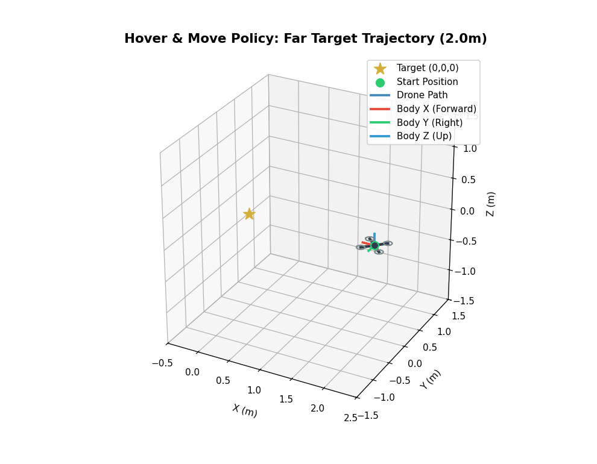
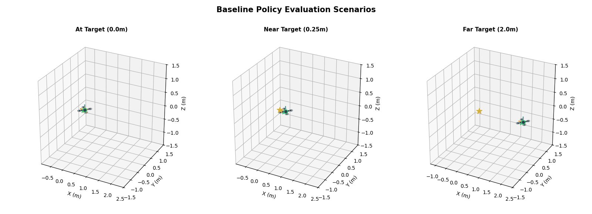
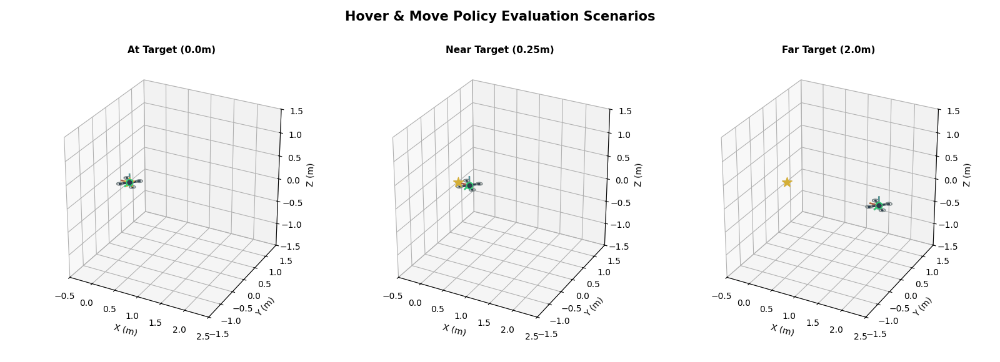
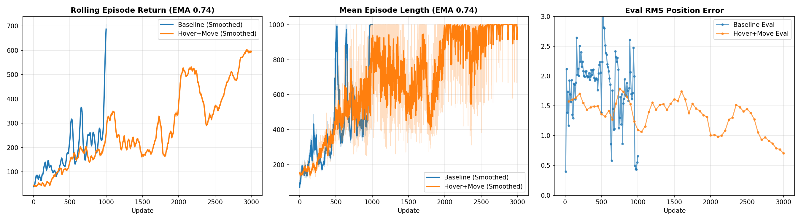

# Quadrotor RL: Precision Hover & Move

This project explores Reinforcement Learning for continuous control of a quadrotor in a 3D environment. The goal is to learn a robust policy that can both transit quickly to a target from far away and achieve high-precision hovering upon arrival, utilizing Proximal Policy Optimization (PPO).

<p align="center">
  
</p>
<p align="center">
  <em>Evaluation of the trained dual-policy agent navigating to the target (0,0,0) from a 2.0m initial offset. Red, Green, and Blue axes indicate the quadrotor's body frame (X=Forward, Y=Right, Z=Up).</em>
</p>

## Closed Loop Architecture
The system consists of a closed-loop PPO control scheme running at 100 Hz ($dt = 0.01$s). 
- **Observation Space (14D):** Position error (3D), velocity (3D), orientation quaternion (4D), angular velocity (3D), and a boolean target indicator.
- **Action Space (4D):** Continuous thrust outputs for each of the 4 independent rotors.
- **Control Rate:** The policy outputs actions directly to the motor models, bypassing traditional cascaded PID controllers.

## First-Principles Rigid-Body Dynamics
Rather than relying on generic black-box physics engines (such as MuJoCo or PyBullet), the quadrotor environment's physical dynamics and numerical simulation pipeline were built from first principles in Python and NumPy. 
- Custom 6-DOF rigid-body differential equations (`src/robots/quadrotor/dynamics.py`).
- Exact quaternion algebra for singularity-free spatial rotation integration.
- Configurable Runge-Kutta 4th Order (RK4) and Euler integrators (`src/simulation/integrators`).
- Built-in static (matplotlib) and high-rate 3D interactive (Rerun) logging.

---

## Reward Design & Cost Saturation Mapping

A core challenge in training continuous control policies is mapping unbounded physical state penalties into bounded, well-conditioned reward signals suitable for PPO value estimation. We employ a **monotone exponential saturation mapping** that smoothly maps any raw physical cost $c_{\text{raw}} \in [0, \infty)$ into a bounded penalty interval $[0, C_{\text{max}}]$:

$$c_{\text{norm}} = C_{\text{max}} \cdot \left( 1 - \exp\left( -\frac{c_{\text{raw}}}{\sigma_{\text{cost}}} \right) \right) \in [0, C_{\text{max}}]$$

The final scalar step reward $R_t$ returned to the PPO agent combines a positive survival bonus $R_{\text{alive}}$ with the normalized cost penalty:

$$R_t = R_{\text{alive}} - c_{\text{norm}} \in [R_{\text{alive}} - C_{\text{max}}, R_{\text{alive}}]$$

*(If an out-of-bounds physical crash occurs, a terminal penalty $R_{\text{terminal}}$ is subtracted).*

### Reward Parameters & Hyperparameters Table

| Symbol | Description | Config Key | Value |
| :--- | :--- | :--- | :--- |
| $R_{\text{alive}}$ | Per-step survival reward bonus | `alive_reward` | `1.0` |
| $C_{\text{max}}$ | Maximum normalized cost limit | `normalized_cost_limit` | `0.9` |
| $\sigma_{\text{cost}}$ | Exponential cost normalization scale factor | `cost_normalization_scale` | `5.0` |
| $R_{\text{terminal}}$ | Physical failure / crash penalty | `terminal_penalty` | `10.0` |
| $\sigma_{\text{gate}}$ | Spatial Gaussian hover gating radius scale | `hover_gate_distance_scale` | `0.30 m` |
| $w_{p}$ | Primary position error cost weight | `position_error_weight` | `4.0` |
| $w_{v}$ | Linear velocity regularization weight | `linear_velocity_weight` | `0.5` |
| $w_{tilt}$ | Excess tilt angle penalty weight | `tilt_weight` | `0.5` |
| $\theta_{\text{max}}$ | Allowed unpenalized tilt angle window | `transit_allowed_tilt_z` | $30^\circ \ (\cos \theta = 0.866)$ |
| $w_{h}$ | Yaw heading alignment weight | `heading_weight` | `0.1` |
| $w_{\omega}$ | Body angular velocity regularization weight | `angular_velocity_weight` | `0.1` |
| $w_{\Delta T}$ | Motor thrust deviation weight (from nominal hover) | `thrust_deviation_weight` | `0.1` |
| $w_{asym}$ | Inter-motor thrust asymmetry penalty weight | `hover_thrust_asymmetry_weight` | `0.5` |
| $\gamma_{v, hover}$ | Linear velocity multiplier in hover regime | `hover_velocity_multiplier` | `2.0` ($\hat{w}_v = 1.0$) |
| $\gamma_{\omega, hover}$ | Angular velocity multiplier in hover regime | `hover_angular_velocity_multiplier` | `2.0` ($\hat{w}_\omega = 0.2$) |

---

## Experiments

We iteratively designed the reward components and policy architecture to overcome the conflicting requirements of drone flight: **moving fast** (requires aggressive tilting and asymmetric thrust) versus **hovering precisely** (requires staying perfectly level with symmetric thrusts).

### 1. Hover Baseline
First, we attempted to learn the task using a single MLP policy and a unified penalty cost. Initial state positions during training were sampled within a tight neighborhood around the origin ($d_{\text{init}} \in [0.0, 0.25]\text{m}$).

* **Raw Cost Function:**
  $$c_{\text{raw}} = w_{p} \|\mathbf{p}\| + w_{v} \|\mathbf{v}\|^2 + w_{tilt} \theta_{\text{tilt}}^2 + w_{h} \theta_{\text{heading}}^2 + w_{\omega} \|\mathbf{\omega}\|^2 + w_{\Delta T} \|\mathbf{T} - \mathbf{T}_{hover}\|^2$$

* **Result:** The agent learns basic survival, but struggles to converge on the target if initialized farther away, often crashing due to accumulated linear velocity. If starting near the target, it oscillates with roughly ~1.0m steady-state position error.

<p align="center">
  
</p>

---

### 2. Gated Dual-Policy: Hover and Move
To handle larger spatial displacements, we expanded the environment's random state initializer to sample initial positions from significantly farther distances ($d_{\text{init}} \in [0.0, 2.5]\text{m}$). To prevent policy interference across this wider operational range, we introduced a **Skill-Gated Task-Conditioned Architecture**.

* **Architecture:** The policy network branches into two parallel MLPs (`hover` and `transit`). The final action mean $\mathbf{\mu}_{\text{action}}$ is a continuous Gaussian interpolation governed by a distance-based gating function:

  $$w_{\text{hover}} = \exp\left( - \frac{\|\mathbf{p}\|^2}{2 \sigma_{\text{gate}}^2} \right)$$
  $$\mathbf{\mu}_{\text{action}} = w_{\text{hover}} \mathbf{\mu}_{\text{hover}} + (1 - w_{\text{hover}}) \mathbf{\mu}_{\text{transit}}$$

* **Gated Raw Cost Function:**
  $$c_{\text{raw}} = (1 - w_{\text{hover}}) c_{\text{transit}} + w_{\text{hover}} c_{\text{hover}}$$

  - **Transit Cost** ($c_{\text{transit}}$) allows up to tilt angle $\theta_{\text{max}}$ for forward motion and penalizes excessive velocity to prevent overshoot:
    $$c_{\text{transit}} = w_{p} \|\mathbf{p}\| + w_{v} \|\mathbf{v}\|^2 + w_{tilt} \max(0, \theta_{\text{tilt}} - \theta_{\text{max}})^2 + w_{h} \theta_{\text{heading}}^2$$

  - **Hover Cost** ($c_{\text{hover}}$) strictly penalizes deviation from a level, zero-velocity state and heavily enforces thrust symmetry:
    $$c_{\text{hover}} = w_{p} \|\mathbf{p}\|^2 + w_{h} \theta_{\text{heading}}^2 + (w_{v} \cdot \gamma_{v, hover}) \|\mathbf{v}\|^2 + (w_{\omega} \cdot \gamma_{\omega, hover}) \|\mathbf{\omega}\|^2 + w_{\Delta T} \|\mathbf{T} - \mathbf{T}_{hover}\|^2 + w_{asym} \|\mathbf{T} - \bar{T}\|^2$$

* **Result & Transition Bottleneck:** Structuring the policy with gated subnetworks significantly improved overall position error (reducing steady-state error from ~1.0m down to ~0.4m) and eliminated physical crashes. However, an architectural transition bottleneck was observed: as the drone approaches the target, it stalls right around the $\sim 0.3\text{m}$ gating boundary ($\sigma_{\text{gate}}$), hovering and oscillating at the $0.3\text{m}$ perimeter rather than smoothly continuing into the origin.

<p align="center">
  
</p>

---

## Experiment Comparison

The dual-policy approach achieves higher asymptotic returns, improved episode survival rates, and significantly lower position error.



### Final Evaluation Metrics
Comparison of final position error across standard 10-second evaluation scenarios:

| Scenario (Start Dist) | Baseline Final Error | Hover+Move Final Error |
| :--- | :--- | :--- |
| **At Target** (0.0m) | 1.012 m | **0.385 m** |
| **Near Target** (0.25m) | 1.011 m | **0.404 m** |
| **Far Target** (2.0m) | 1.003 m | **0.473 m** |

---

## Conclusion & Recommended Next Steps

### Current Results
Comparing both experiment iterations demonstrates the impact of task-conditioned subnetwork gating:
- **Baseline Single-MLP Policy:** Operating under tight initializations ($d_{\text{init}} \le 0.25\text{m}$), the unified single policy failed to maintain station-keeping, exhibiting substantial drift ($\sim 1.0\text{m}$ error) and tumbling when evaluated from larger offsets.
- **Gated Dual-Subnetwork Policy:** Expanding the training initializations up to $2.5\text{m}$ while decoupling transit and hover dynamics yielded marked stability improvements. The dual policy achieved 100% survival across all 10-second evaluation scenarios and cut final position error by more than half ($\sim 0.4\text{m}$ vs. $\sim 1.0\text{m}$).
- **Key Limitations:** Smooth exponential gating ($\exp$) created a soft transition boundary around $\sigma_{\text{gate}} = 0.30\text{m}$. The agent learns to navigate rapidly toward the target region, but stalls and oscillates right at the $0.3\text{m}$ switching radius instead of settling directly at the origin.

### Recommended Next Steps
1. **Staged Curriculum Learning Scheme:** Implement a structured two-stage training curriculum for the dual-network architecture — first train the `transit` subnetwork on wide-area navigation, then freeze its weights and train exclusively the `hover` subnetwork on near-target initializations.
2. **Sharper / Piecewise Transition Functions:** Replace smooth exponential ($\exp$) or $\tanh$ gating with a sharper or piecewise transition schedule. Smooth functions diffuse gradient signals across spatial boundaries, whereas a sharper transition provides localized, informative policy gradients right at the switching threshold.
3. **SNS MLP with Bounded Derivatives:** Explore Smooth Neural Networks (SNS) / MLPs with explicitly bounded derivative properties for policy parameterization, providing smoother, well-conditioned policy gradients to stabilize PPO actor updates.
4. **PX4 Baseline & Trajectory-Guided Pre-Training:** Implement a classical PX4 controller as a physical benchmark and integrate its generated reference trajectories into the learning pipeline (e.g., via behavioral cloning initialization or expert demonstration guidance).

---

## Interactive 3D Inspection with Rerun

Full high-fidelity evaluation recordings are included in the repository under `docs/recordings/` in Rerun `.rrd` format. You can inspect full interactive 3D trajectories with timeline controls and motor force dynamics without running training:

```bash
# Hover & Move Far Target Scenario
rerun docs/recordings/hover_move_far_target.rrd

# Baseline Far Target Scenario
rerun docs/recordings/baseline_far_target.rrd
```
